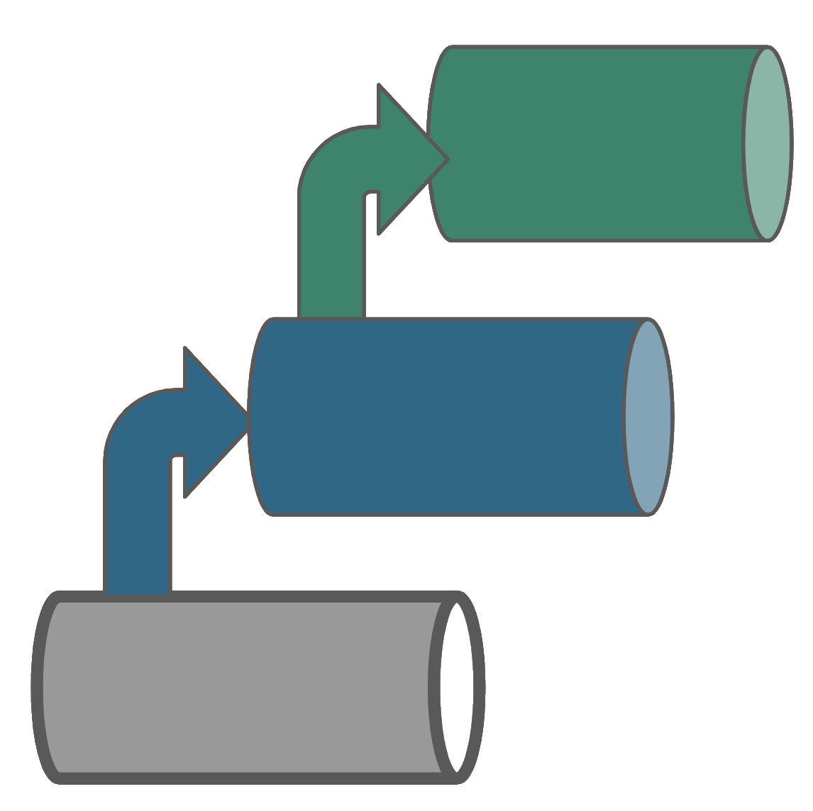

<h1>BrainTool: Manage Your Online Life</h1>

We're all overwhelmed with links and tabs as we do more and more of our work and play in a web browser. [BrainTool](https://braintool.org) helps you tame your tabs and curate your bookmarks.
- Quickly add a note to any web page, assign a topic or a TODO and close it out. 
- Open and close groups of tabs with a single click as you move between tasks. [(See this 50 second demo)](https://braintool.org/2021/10/06/Control-Your-Browser-with-the-Keyboard.html)
- Keep your browser workspace clean. [(See this 3 minute demo)](https://braintool.org/2021/12/08/Clean-up-your-tabs-with-BrainTool.html)

Check it out at [braintool.org](https://braintool.org) or contact braintool.extension@gmail.com for more information.

# MetaOnco: UI meets ML for Clinical Data Abstraction
Using rapidly evolving Machine Learning techniques to augment battle tested best practices in User Interface design, Workflow Automation, and Healthcare InterOp, MetaOnco augments human knowledge workers performing clinical data abstraction and transformation.

This allows the information content inherent in healthcare data to be annotated and leveraged beyond its original purpose.

<h1>Health Value Pipelines</h1>

Health Value Pipelines are threads of value woven into the healthcare ecosystem by way of data processing and information creation, both by humans and intelligent automations, and by collaborations between the two. See [HealthValuePipelines.com](https://healthvaluepipelines.com)

# Fun-Tipper: Can you find a good palindromic tip?
A Palindromic Tip is where both the tip and total amounts read the same forward and backward. Fun-tipper is a fun little app that finds them. Can you find one before checking the app? Try it the next time you are dining out. Check it out and pin it to your home screen: [fun-tipper.com](https://fun-tipper.com/)

| Cost | $72.38 |
| ---- | ------ |
| Tip  | $17.71 |
| Total | $90.09 |
